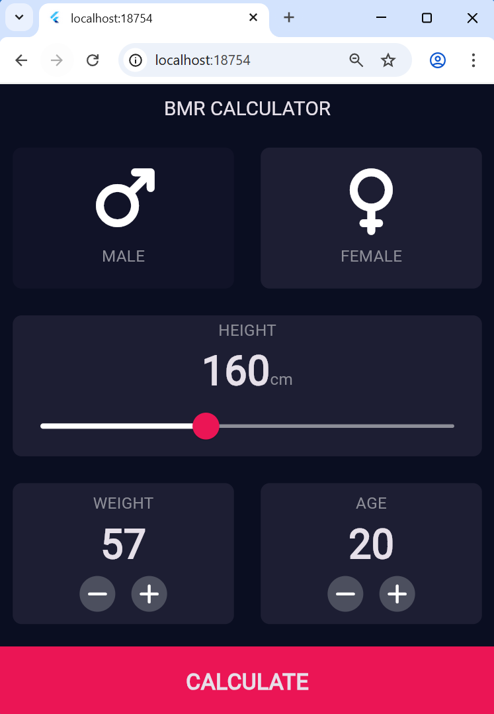

# BMR Calculator

# Anggota Kelompok
- Andien Amalia Fitri (K3523012)
- Diana Novitasari (K3523024)

# Deskripsi
Aplikasi BMR Calculator dibuat menggunakan Flutter untuk menghitung kebutuhan kalori basal seseorang berdasarkan berat badan, tinggi badan, usia, dan jenis kelamin menggunakan rumus Mifflin-St Jeor.

# Hasil Screenshot
1. 
2. 
